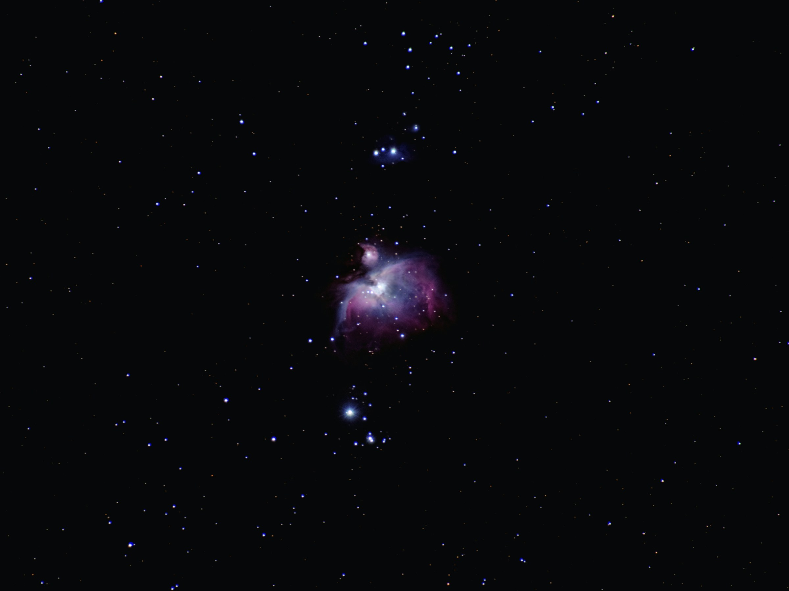
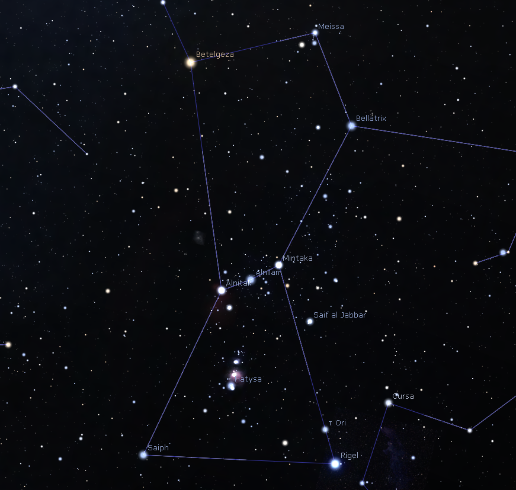

# **Orion**

Orion - a raczej jego pas to był pierwszy układ gwiazd który wzbudził we mnie chęć poszukiwania innych konstelacji na niebie.

## **Mityczne pochodzenie Oriona**
Gwazdozbiór Oriona jest bardzo charakterystyczną grupą gwiazd, która wzbudzała fascynację na przestrzeni wieków. Na ziemiach Mezopotami Oriona uważano za boga-pasterza *Tammuza*, dla Syryjczyków był on olbrzymem *Al Jabbar*. Egipcjanie widzieli w nim *Sahu* czyli duszę Ozyrysa a w mitologii greckiej był myśliwym.

## **Charakterystyka**
Na niebie szukaj siedem gwiazd tworzących klepsydrę, przez której środek przechodzą trzy gwiazdy.

Gwiazdozbiór Oriona. Stellarium/R. Strzondała

Gwiazdy pasu:

| Gwiazda | Odległość (lś) | Wiek gwiazdy (w latach) |
|------------|------------|------------|
| Alnitak  | 1262  | 9 000 000   |
| Alnilam  | 1340  | 4 000 000  |
| Mintaka  | 1200  | 10 000 000  |

## **Gdzie i kiedy Go znaleźć**
W Polsce Orion jest najlepiej widoczny od października (po pólnocy po wschodniej stronie nieba) do końca lutego ( do pólnocy po zachodniej stronie nieba)

## **Obserwacje**
Szukając konstelacji, gwiazd, planet czy mgławic nieocenioną pomoc niesie aplikacja Sterllarium która pokazuje widok nieba w czasie rzeczywistym. Link do strony znajduje się [tutaj](https://stellarium.org/). Aplikacja jest również do pobrania na Sklep Play lub App Store.

